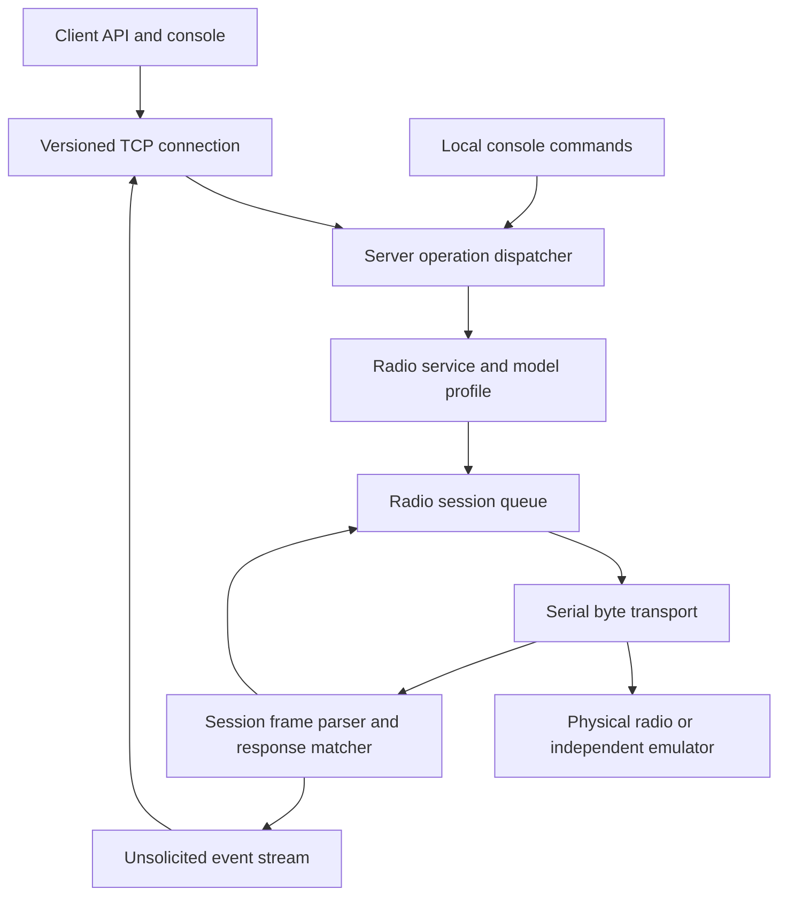

# SharpCAT2 usability and release plan

## Purpose and status

Deliver a maintainable native .NET radio-control library and TCP server that can be developed, demonstrated, and tested without owning a radio. The first release target is a clearly labeled preview with reliable transport and a small FT-991A operation set verified against documentation and simulation. Physical compatibility remains unverified until a contributor supplies hardware evidence.

The user authorized Phases 0, 1, 2 and 3 implementation and permits issues/PRs and merges after gates pass. Later implementation phases remain proposed. This document does not establish hardware compatibility or authorize a product release. Proposed names below describe responsibilities; choose final names when implementing the owning phase.

Planning baseline, checked October 5, 2026:

- `/mnt/projects/SharpCAT2`, branch `main`, clean before this document, matches live remote HEAD `84d07f554fdcde43c63795139c047bbd7d98bac3`. No additional checkout, reset, or branch switch was needed. GitHub showed no open issues or PRs.
- Validation in this chat: solution build had zero warnings/errors; 267 tests passed and four were skipped. Tests ran on .NET 10 with .NET 8 roll-forward, not a native .NET 8 runtime.
- Temporary evidence is under `/tmp/sharpcat-validation`; it is useful local evidence but is not a durable repository dependency. Convert the targeted probes into maintained tests during implementation.
- Hindsight returned no relevant SharpCAT2 knowledge. Source and current validation own the baseline.

## Product scope and completion criteria

A new user must be able to build, start a simulated radio server, connect the supplied client, inspect identity and capabilities, read and change frequency and mode, observe the resulting state, disconnect, and reconnect by following one short guide. The same production command path must be used for simulation and a serial-connected FT-991A.

Preview scope:

- One selected radio per server process, with multiple clients sharing a serialized command queue.
- FT-991A identification, VFO-A/B frequency reads and writes, documented mode reads and writes, and VFO swap. Do not map a generic “select VFO” API to an invented command. Audit receive/transmit VFO semantics before exposing any selection operation.
- Explicit connection and operation outcomes, bounded resource use, cancellation, clean shutdown, and recoverable transport loss.
- A cross-platform in-memory demo plus Linux pseudo-terminal integration through the real serial adapter.
- Core/server/client libraries, console applications, reproducible builds, CI, support metadata, and a contributor verification procedure.

Deferred: additional radio implementations, real binary CI-V, flrig, simultaneous radios in one process, user-supplied JSON radio definitions, third-party virtual COM integration, web UI/API restoration, audio, transmit/PTT control, and Internet-facing authentication/TLS. Keep these out of preview acceptance. A pseudo-terminal used by CI is test infrastructure, not a shipped virtual COM product.

A successful preview is useful software, not a hardware certification. Do not require hardware ownership to finish it. A later stable hardware-support claim requires evidence for the specific model and operations concerned.

## Verified defects and affected owners

| Finding | Current owner | Planned disposition |
| --- | --- | --- |
| Empty successful writes become false setter results | `RadioCommand`, `BaseRadio`, manufacturer base classes | Typed result contract and explicit response policy |
| Core operations bypass manufacturer builders | `BaseRadio`, `IRadioProtocol`, model classes | Every implemented operation delegates to its profile |
| Concurrent writes and shared buffer clearing | `BaseRadio`, resilience wrappers, console raw command path | One session owns transactions and serial reads |
| Hardware broadcast handler rejects original SerialPort sender | `RealSerialPort`, `ResilientSerialPort`, `ServerApplication` | Stop using application DataReceived handlers as readers |
| TCP chunks treated as messages and single-read responses | `NetworkService`, `ClientLib` | Versioned framing and one network reader/writer per connection |
| Multiple retry/reconnect/health owners | `ResilientRadio`, `ResilientSerialPort`, client, server retry helper | Centralize serial recovery; do not replay uncertain mutations |
| CI-V placeholders advertised as supported | Icom profile, factory, support docs | Mark unsupported placeholder operations; no binary repair in this scope |
| Console lifetime depends on ReadLine and mishandles EOF | `Program`, `ServerApplication` | Generic Host lifetime independent of stdin |

The earlier assessment overstated competing reads on real hardware: the event sender mismatch currently prevents the console reader from acting there. Fake-port events use an ISerialPort sender and can take that path. Fixing event forwarding alone would expose a competing reader; the whole ownership change is required.

## Architecture and ownership



| Component | Sole responsibility | Must not own |
| --- | --- | --- |
| Core contracts | Requests, results, capabilities and wire DTOs | Ports, retry timers, model-specific opcodes |
| Model profile | Encode commands, split protocol frames, match/parse replies, validate values | Serial reads, background timers, networking |
| Radio session in ServerLibrary | Open/close, queue, one active transaction, read loop, timeouts and recovery | Console input, TCP framing |
| Serial adapter | Byte I/O and serial settings | Command retries, radio state or broadcasting |
| RadioService | Selected profile/session and public operations | A second port reader or recovery loop |
| NetworkService | Accept clients, decode/encode bounded envelopes, await dispatcher | Direct serial writes or model parsing |
| Client library | One receive loop, correlate responses, expose typed calls | Guessing CAT reply boundaries or retrying mutations |
| ServerConsole | Configuration, dependency wiring, host lifetime and presentation | Protocol implementation or competing command routes |
| Simulator | Independent documented device behavior and fault injection | Production command builders/parsers |

Use asynchronous awaited handlers for requests. Events are appropriate for notifications, not unawaited request processing. Consolidate the active ServerApplication routes and existing command-handler services; do not leave a second dispatch path behind.

### Serial transaction contract

Introduce a byte-oriented transport seam so encoding belongs to the protocol profile. This prepares a clean boundary for future CI-V without implementing it now. Use cancellable asynchronous adapter operations where reliable; if platform SerialPort reads cannot be cancelled, use one bounded read worker, finite timeouts and close-to-unblock. Prove shutdown on each claimed platform. Do not launch an unbounded Task.Run per poll/read.

Phase 1 defines a byte transport contract whose writes preserve the supplied bytes exactly; Phase 2 replaces the active string-only `ISerialPort` command path with that owner. Profiles do not accept ports and cannot open, close, read, or dispose them. The session owns the transport lifetime, including disposal on failed startup and shutdown. Remove `BaseRadio` transport ownership in Phase 2, not only its reader. Prefer automatically adapting supported `IRadio.ConnectAsync(ISerialPort)` calls into the session rather than forcing source changes. The legacy bridge is restricted to documented ASCII CAT use and delegates through the same session; it does not represent a lossless binary bridge. Unsupported legacy signatures or protocols require explicit errors and migration notes. A caller must explicitly transfer transport ownership when constructing a session, and a disposed session cannot reuse that transport.

Each command specification contains payload bytes, response policy, expected reply matcher/parser, deadline, and replay classification. Response policies are `WriteOnly`, `ReplyRequired`, and `WriteThenReadBack`. A write and its verification query run as one queue item so another client's mutation cannot interleave.

Return separate fields for outcome and evidence:

- Outcome: `Succeeded`, `InvalidArgument`, `NotSupported`, `NotConnected`, `Busy`, `TimedOut`, `Cancelled`, `ProtocolError`, `TransportError`, or `OutcomeUnknown`.
- Evidence: `NotSent`, `WriteAttempted`, `Written`, `ReplyReceived`, or `ReadBackVerified`.
- Optional parsed value, observed timestamp, connection generation and diagnostic detail.

A write-only command can succeed with `Written`; it does not prove radio acceptance. Frequency/mode setters in the preview use read-back verification by default. VFO swap is never automatically replayed; verify resulting state where possible, and retain uncertainty if the reply is lost. Properties and status must distinguish requested values from observed values. Failed reads never silently become a valid zero frequency or USB mode.

Proposed bounded defaults, to be confirmed by tests rather than treated as hardware facts: 64 queued operations per radio, 16 per connection, 16 clients, 5-second total operation deadline including queue wait, 4096-byte serial frame limit, 10-second shutdown budget. Enforce both count and byte limits. Reject excess work explicitly; no silent queue drops. A command waiting in the queue must be cancellable without touching the port.

The read loop continuously assembles complete frames, retains incomplete tails, and splits multiple frames. Route valid unsolicited frames separately. Never clear input/output buffers before each transaction. Any deliberate startup discard belongs to a documented synchronization sequence, not normal command execution.

Cancellation before a write guarantees no command was sent. Cancellation or failure after a write does not undo it; record `OutcomeUnknown` for mutations when the effect cannot be established. Keep transaction ownership until its response has been consumed or the session has entered recovery. A disconnected TCP client must not free the serial slot while its reply is still outstanding.

### Timeout, recovery and response ambiguity

Lifecycle: `Disconnected -> Connecting -> Ready -> Recovering -> Ready`, with terminal `Faulted` and `Stopping` states. Only the session opens/closes/reconnects. Remove or delegate the active timers and replay logic in both resilience wrappers. Health probes use the same queue and run only while idle.

After a reply timeout or uncertain I/O, do not issue the next queued command on the same stream. Fault the current connection generation, fail queued work without replay, stop the reader, close the port and clear parser state. Physical disconnect may trigger bounded reconnect attempts at 1, 2 and 4 seconds; exhaustion remains visible until explicit reconnect. Shutdown cancels those attempts.

CAT replies lack transaction IDs. A matching opcode does not prove that a reply belongs to a newer request, and closing a port does not prove a device abandoned an old request. The FT-991A profile must specify startup synchronization, handling of automatic information, and a bounded quiet/drain interval. If those rules cannot establish adequate separation after a timeout, require explicit reconnect and report the limitation. Do not claim arbitrary delayed same-opcode replies can always be disambiguated. Simulator tests must expose this limitation instead of hiding it with a convenient delay.

Default: no automatic operation retries in the preview. Recover the connection, then let callers make a new explicit request. A future read-only retry policy can be added after synchronization is proven. TCP request IDs are correlation identifiers, not durable deduplication or an exactly-once guarantee.

## TCP protocol and compatibility

Propose a new versioned protocol rather than silently changing the old unframed stream. Use one UTF-8 JSON object per LF-terminated frame. Literal line breaks in values are JSON-escaped; CRLF input is accepted. Decode complete bounded frames, not individual socket reads. Maximum encoded frame size: 64 KiB; reject invalid UTF-8, malformed envelopes, unsupported versions, reused or out-of-order request IDs, and oversized/incomplete frames with defined errors or connection closure.

Every envelope has `v`, `type`, and an ID where applicable. First request is `hello` with version and client identity; no radio operations before successful negotiation. Initial operations: list models/capabilities, list ports, get connection/status, get/set frequency, get/set mode, swap VFOs, and explicit reconnect. Radio selection stays in startup configuration for this preview; remote model switching is deferred to avoid another connection lifecycle.

Example proposed wire exchange:

```json
{"v":1,"type":"request","id":"42","op":"getFrequency","args":{"vfo":"A"}}
{"v":1,"type":"response","id":"42","outcome":"Succeeded","evidence":"ReplyReceived","value":{"hz":14250000}}
```

Remote cancellation is a control request with its own ID and `op:cancel`, targeting an earlier request ID on the same connection. Its acknowledgment reports whether cancellation was requested, the target was already completed, or the target was unknown; only the target's single terminal response establishes the operation outcome. Cancellation/completion races may legitimately produce an already-completed response. For queued work successfully removed before a write, the target returns `Cancelled/NotSent`. Once a write starts, cancellation cannot establish that nothing happened; preserve the transaction slot until reply consumption or recovery and report the available evidence or `OutcomeUnknown`.

The receive loop admits bounded request tasks and remains available for cancellation instead of awaiting each radio operation inline. Control requests bypass the radio queue but obey connection/resource limits; the session atomically coordinates cancellation versus dequeue/write. Requests can supply a relative deadline, capped by the configured server maximum and measured from server admission, including queue wait. Client disconnect cancels queued work; written work follows the same reply-consumption/recovery rule. A local client timeout means abandonment, not confirmed server cancellation. The client may send cancellation while connected but must retain mutation uncertainty until an authoritative terminal response arrives.

Request IDs are strictly increasing positive decimal sequence numbers encoded as strings and never reused within a TCP connection, including after completion or abandonment. The server checks against the last admitted sequence number, avoiding an unbounded ID history; wraparound requires a new connection. Client pending-call keys include the connection generation. Responses without an active matching key are discarded, including after any abandoned-history eviction. Test a delayed response after history eviction and reconnect to prove it cannot complete a newer request.

A list is one response object containing an array, not START/END text markers. Notifications use `type:event` and cannot complete pending calls. Each connection has one receive loop and one bounded output queue/writer; broadcasts never write directly to a NetworkStream concurrently with responses. Disconnect a slow consumer when its bounded queue fills. Fail all pending client calls exactly once when the connection closes. Client-side timeouts after sending mutations report uncertainty and never resend automatically. Keep a bounded record of abandoned IDs so late responses can be discarded safely.

Use the current configurable server port, but explicitly document the breaking wire change. Old plain-text clients receive a bounded incompatibility error and disconnect; new clients fail hello against old servers without falling back to raw commands. Do not maintain two simultaneously active protocols in the first preview. Retain a tagged old release as the migration/rollback path. Decide the actual release version from existing published versions during release preparation; use a breaking prerelease version, not an accidental patch release.

Typed library operations become the supported API. Automatically route supported old bool/string methods through deprecated adapters where semantics can be honest: bool true means the declared completion policy succeeded, and write-only string success remains empty rather than invented `OK`. Document source-breaking signatures/removals in the migration guide. Do not preserve an API by retaining a second command owner. Raw SendCommand compatibility requires an explicit completion policy and the same session queue; unknown raw commands are not enabled through the default remote API.

## FT-991A profile and independent proof

Use the manufacturer's [FT-991A CAT manual](https://www.yaesu.com/Files/4CB893D7-1018-01AF-FA97E9E9AD48B50C/FT-991A_CAT_OM_ENG_1711-D.pdf) as the protocol authority. Its frequency example uses `FA014250000;` for 14.25 MHz, and identification specifies `ID0670;`. The current common/Yaesu builders must not be assumed correct. Document every included operation's opcode, parameter width, units, valid values, reply format and page reference before writing its implementation.

Keep the first profile small: identity, frequency A/B, mode and swap. Reconstruct status from supported reads with per-field validity; do not advertise the full inherited feature bitmask. A base-class fallback must return NotSupported where no model mapping exists. Generic Yaesu changes must not silently promote all Yaesu models to verified status.

Store hand-reviewed exact-byte fixtures with source title, revision, page and rationale. Include boundary and malformed cases. The simulator uses separate code and state transitions; it may share fixtures but never production builders or parsers. One bad shared interpretation remains possible, so review fixtures against the manual separately from reviewing production code. Do not copy the complete manual into the repository without checking redistribution rights.

The simulator supports stateful frequency/mode changes, no-response writes, query responses, scheduled unsolicited messages, fragmented/coalesced delivery, silence, invalid frames, disconnects and delayed replies. Deterministic scripted scenarios use a controllable clock; ordinary tests do not depend on arbitrary sleeps. The existing FakeSerialPort remains a transport fake, and DummyRadio remains explicitly a dummy; neither is hardware evidence.

Provide two transports to the same emulator: an in-memory duplex byte stream for the portable demo and a Linux PTY harness for integration. A small Python standard-library `pty` launcher can allocate a raw-mode terminal, relay emulator bytes, launch the actual server/client executables and enforce cleanup/timeouts. The application under test opens the slave through RealSerialPort. This tests operating-system serial I/O without installing a virtual COM driver or introducing Hamlib/PInvoke into the product. Windows/macOS real serial behavior remains outside the proven scope until platform-specific evidence exists.

## Hosting, configuration and support policy

Use .NET 10 for all preview projects and CI, with a checked-in SDK policy. .NET 8 ends support November 10, 2026; .NET 10 is supported through November 14, 2028, per the [Microsoft support policy](https://dotnet.microsoft.com/en-us/platform/support/policy/dotnet-core). Avoid carrying two runtime targets without a demonstrated consumer need. Retarget separately from behavioral changes; update packages only where required for compatibility/security and record the reason.

Run the server through Generic Host startup, cancellation and shutdown. Default unattended mode never prompts and requires a valid port/profile or explicit simulation option. `--interactive` attaches a console reader; EOF detaches that reader while the host keeps running. SIGTERM/Ctrl+C stop accepting commands, resolve pending operations, stop readers/recovery, close sockets/port and finish within the shutdown budget. Startup failure returns a nonzero exit code; do not silently fall back to fake hardware. Provide a Linux systemd example; Windows service installation is deferred, while foreground/headless process operation is tested on Windows.

Configuration order is explicit CLI value > config file > default. Track whether an option was supplied rather than comparing it to its default. Validate profile, serial settings and network limits before opening resources. Automatically migrate recognized older configuration on startup: validate the full replacement first, preserve values, write a backup and atomically replace the file, record its schema version, and make repeated startup idempotent. Failed backup/validation/replacement must leave the original file intact and fail with an actionable message. Do not overwrite configuration automatically on shutdown. Preserve serial baud/parity/stop/flow-control settings as explicit configuration and record them in diagnostics.

Default network bind is loopback; LAN listening requires explicit bind configuration and the existing allowlist checks. This preview is for local/trusted-network control, not an authenticated Internet service. Do not describe IP filtering as authentication. Keep rate/resource limits at admission boundaries and test them. No TLS/auth project is required to ship this scoped preview.

Capabilities report both operation availability and evidence level: unavailable, experimental, protocol-tested, or hardware-verified. Hardware evidence is per operation and includes model, firmware, OS, adapter/settings, software revision and date. Preserve existing model names for discoverability, mark unverified implementations experimental, and reject known placeholder operations rather than sending CIV-prefixed simulation strings to hardware. Retained experimental profiles must still use the single session owner; if they cannot be migrated honestly, disable their execution with an explanation rather than keep a competing legacy stack.

## Lead and delegated execution

The lead owns architecture, lifecycle and compatibility decisions, scope changes, integration, and final acceptance. Use up to three workers alongside the lead, within the available four concurrent slots. Shared-checkout work uses disjoint file assignments; workers may not switch branches, create worktrees, or change another worker's files. Build, restore and packaging runs are coordinated by the lead to avoid shared output races.

Choose worker models by task difficulty and currently available capability/cost information. Start bounded research and readiness audits on the smaller available model; use a coding model for implementation and substantive independent review. Actual quota cost is not exposed in this session, so no specific saving is claimed. Escalate on unresolved reasoning or failed evidence rather than repeating the same attempt.

| Assignment | Worker responsibility | Lead acceptance |
| --- | --- | --- |
| Baseline and CI | Audit/implement SDK targeting and workflow in assigned files | Inspect exact diff, reproduce native runtime proof, distinguish hosted Windows results from local Linux checks |
| Protocol research | Prepare operation table and manual-backed fixtures | Independently verify parameter widths, units and supported semantics |
| Profile or simulator | Implement one side against frozen contracts in disjoint files | Review both separately; prohibit production-builder reuse in emulator |
| Architecture review | Read-only review of lifecycle, late replies and compatibility | Resolve material findings before contracts/owner changes |
| Candidate verification | Independent read-only check of exact candidate and tests | Reproduce key evidence; a worker summary does not establish correctness |

Every assignment includes objective, completion criteria, exact file/write scope, source snapshot, dependencies, required checks, and stop conditions. Workers report changed files and actual evidence, not just conclusions. Delegate independent tasks concurrently only after contracts are settled; serial ownership and the compatibility boundary remain centralized with the lead.

The first delegated pass is read-only: a Phase 0 readiness audit and an independent plan review. Integrate their findings into this document before starting production changes. Each implementation phase then has a bounded scope packet and a separate review/evidence path. Publication remains a distinct user-authorized action.

## Delivery sequence and acceptance gates

Each phase is a separately reviewable change. The production refactor is expected to span multiple projects and substantially more than a small bug fix; do not bundle it into one mechanical repair. These are proposed slices, not time estimates or authorization to publish them.

| Phase | Work and primary files | Dependency | Required evidence |
| --- | --- | --- | --- |
| 0 Baseline and CI | `global.json`, project files, solution, `.github/workflows`, test categorization | Plan accepted | Native .NET 10 build/tests on Linux and Windows; explain all four historical skips; clean reproducible restore |
| 1 Contracts and fixtures | Core result/command/capability DTOs; ServerLibrary profile contract; tests/fixtures; migration and wire specifications | 0 | Reviewed FT-991A fixture table; result/cancellation/state transition tests; no invented defaults |
| 2 Session and serial ownership | New session/transport adapters; BaseRadio; both resilience wrappers; RadioService; console serial handlers | 1 | One reader/transaction owner; queue/cancel/timeout/disconnect tests; no buffer clearing per command; old readers/timers removed |
| 3 FT-991A and emulator | FT-991A profile; model dispatch; separate simulator project; support metadata | 1, 2 | Exact-byte and read-back tests; invalid values rejected; emulator-independent fixture review; no generic fallback for included operations |
| 4 TCP and client | Core wire DTOs; NetworkService; ClientLib; server dispatcher; console clients | 1, 2, 3 | Fragmentation/coalescence, notifications, correlation, limits, old/new incompatibility and uncertain-mutation tests |
| 5 Host and end-to-end demo | ServerConsole host/config; portable demo launcher; Linux PTY harness; CI integration job | 2, 3, 4 | Actual executables complete demo; PTY real-adapter path; EOF/SIGTERM/reconnect and resource cleanup |
| 6 Release preparation | README, support matrix, migration guide, diagnostics, package metadata, release workflow | All above | Clean archive build/demo; package consumer smoke test; accurate evidence labels; complete release checklist |
| 7 Hardware verification | Contributor procedure and reviewed evidence records | Optional after 6 | A contributor reproduces the named operations on physical hardware; only those labels are promoted |

Phase 0 should replace genuinely obsolete skipped tests with current transport behavior tests or document their removal; do not just unskip tests whose assumptions are wrong. Keep existing useful coverage throughout migration. Temporary characterization tests may document old failures, but must not freeze defects as desired behavior.

Start implementation by translating the existing validation harness into meaningful regressions in the owning phase. Red tests belong in the working change, not a knowingly broken main branch. Each merged/published slice must leave the supported build green. If a phase cannot preserve one owner at its boundary, combine the necessary migration into that phase rather than shipping two active owners.

### Phase 0 scope packet

Objective: establish a native .NET 10 baseline and required CI without changing radio or networking behavior. Proposed file scope is `global.json`, the six existing project files and their generated `packages.lock.json` files, `.github/workflows/ci.yml`, the four obsolete cases in `ResilientSerialPortTests.cs`, and the associated development instructions. Keep package changes narrowly justified; audit the unused old ASP.NET MVC test dependency separately from runtime compatibility.

Replace the skipped wrapper tests with injected mock-port tests that verify Write/WriteLine forwarding, returned ReadExisting data, and event forwarding without relying on CAT simulation or Thread.Sleep. Event tests characterize wrapper forwarding only; the later session migration owns the hardware application sender bug. Do not remove coverage just to produce a zero-skip count.

Enable NuGet lockfile generation, review the resulting dependency changes, commit each project lockfile, and use `dotnet restore SharpCAT2.sln --locked-mode` in CI. Initial lock generation is an explicit development step; CI must fail rather than update locks silently.

CI runs restore, Release build and tests using an installed native .NET 10 runtime on Linux and Windows. Capture TRX/log artifacts on failures. Local Linux evidence does not establish Windows success; the first hosted run is required before Phase 0 is called complete. Pin the selected SDK feature band consistently, allow supported servicing patches, and record restore/tooling failures separately from application failures.

The implementer reports exact changed files, runtime/SDK, commands, test totals and any remaining skips. The reviewer verifies scope, checks that old behavior was not frozen as a regression expectation, and reviews workflow permissions and artifact handling. The lead runs the frozen candidate checks once, then integrates only after material findings are resolved.

## Test matrix and proof requirements

| Layer | Scenarios | Release requirement |
| --- | --- | --- |
| Profile | Exact identity/frequency/mode bytes; bounds; unsupported commands; invalid/partial replies | Every advertised operation has positive and negative fixtures |
| Session | Two clients, queue overflow, cancellation before/after write, no-response writes, atomic read-back, delayed same-opcode reply, loss during write, idle probes | No interleaving/misattribution in modeled cases; ambiguous cases reported explicitly |
| Framing | Every split point of representative frames; several frames per read; UTF-8 split boundaries; CRLF; oversize/invalid/unterminated input | No chunk-based dispatch or unbounded buffering |
| Client/server | Multi-client ownership, response versus event, large lists, duplicate IDs, slow/disconnected client, partial writes | Correct correlation; no command replay; bounded queues |
| Lifecycle | Start failures, idle EOF, signal shutdown, unplug/reopen simulation, cancellation during recovery | No busy spin; no leaked tasks/ports; bounded shutdown |
| Full application | In-memory demo on Linux/Windows; real serial adapter through Linux PTY | Both executable paths pass from a clean build |
| Packaging | Packed libraries consumed by a small external sample; console archives start and demo | Published artifacts match tested commit and declared runtime |

Suggested automated endurance gate: 1,000 mixed deterministic operations across eight clients with injected fragmentation and bounded delays, followed by repeated connect/disconnect cycles. Assert all calls reach one terminal outcome, no duplicated mutations, no pending tasks/queue items after cleanup, and repeatable results. This is a software regression target, not a hardware latency/performance claim.

Use xUnit and the existing test stack unless a specific limitation justifies a change. Bind test listeners to loopback port zero, discover assigned ports and avoid fixed-port collisions. CI jobs have time limits, capture logs on failure, and clean up child processes/PTYs in finally blocks. Fast unit/loopback tests run on every PR; Linux PTY integration and package smoke tests are required before preview publication. macOS can be added as an advisory build job until its behavior is explicitly supported.

Run focused checks while editing, then the affected/full suite once for the frozen candidate. Repeat broad checks only after a relevant change or failure. Pin workflow dependencies according to current repository policy when implementing, use minimum token permissions, and never expose release credentials to untrusted PR jobs.

## Diagnostics and contributor verification

Provide a diagnostic command that records version/commit, profile, firmware when readable, OS/runtime, serial configuration, connection generation, operation outcomes and an optional timestamped byte transcript. Transcripts stay local and require an explicit upload action by the user. Exclude secrets and allow removal of identifying device paths/serial numbers before sharing.

The default hardware procedure is read-only: identify, query frequency/mode, disconnect and reconnect. A separate operator-approved write procedure records original settings, changes frequency/mode, verifies the result and attempts restoration; report restoration failure. Never key the transmitter as part of this preview's verification. Provide an issue template and a small evidence file format that can be reviewed without specialized test equipment.

Do not let one report promote every feature or an entire manufacturer. Conflicting firmware results downgrade or qualify only the affected capability. Diagnostics are evidence, not automatic certification.

## Release and maintenance

Preparation produces a changelog under Unreleased, migration notes, a runnable example, library packages and console archives, checksums, and a checklist tied to an exact commit. Publish core/server/client packages only after a local package-feed consumer test verifies dependencies and public APIs. Avoid self-contained/trimming/AOT support in the initial scope; framework-dependent artifacts reduce platform claims and release work.

Publishing a tag, GitHub Release, or NuGet package is a later explicit release action. This planning request does not publish anything. Before that action, inspect existing releases/package ownership and choose a nonconflicting breaking prerelease version. After publication, download/install the public artifacts in a disposable location and repeat the demo; a successful upload alone is not completion.

Maintenance policy: prioritize reproducible command/transport failures, keep the supported runtime patched, and require protocol fixtures plus capability evidence for new support claims. Add models only when someone can supply a manual and maintain verification. Keep deferred feature ideas as backlog notes; no obligation to pursue them to call the preview complete.

## Risks, alternatives and stop conditions

- A small semaphore patch would prevent some overlaps but leave competing readers, raw writes, recovery timers and framing unresolved. Reject it as the complete repair.
- Merely changing the DataReceived sender would enable another reader. Replace the ownership path, not just the cast.
- Reusing production protocol code inside the emulator would produce circular validation. Keep implementations independent and review fixtures separately.
- Keep supported legacy API calls as automatic adapters into the new owner, and migrate known configuration schemas with backup. Old compiled TCP clients require software upgrades; avoid a second legacy command execution stack. Clearly document unsupported operations and wire incompatibility.
- A generic plugin framework, comprehensive binary protocol engine, or full radio registry is unnecessary for one verified profile. Defer it.
- Hardware timing, electrical/driver behavior, firmware quirks, and arbitrarily delayed untagged replies remain limits. State them precisely; do not substitute 267 passing tests for hardware proof.

Stop and revise the relevant design before continuing if a change introduces a second serial reader/reconnect owner, a setter needs unsafe replay to appear reliable, TCP completion still depends on a socket read boundary, a profile requires undocumented commands, or maintaining old APIs would keep two active implementations. If the scope grows into another radio family, authentication service, or multiple-radio scheduler, separate that initiative rather than absorbing it here.

The selected defaults are concrete planning decisions, not hidden requirements: .NET 10, one FT-991A subset, a breaking versioned JSON protocol, one session owner, no automatic operation retries, trusted-network scope, and a protocol-tested preview. Revisit a default only for new evidence or user direction. Hardware ownership is not a blocker to phases 0 through 6.

## Initial independent review

A bounded readiness audit by `gpt-6-luna` and a separate architecture review by `gpt-6.1-sol` were completed on October 5, 2026. Both were read-only. The lead checked the relevant source and integrated the three material architecture findings: remote cancellation/deadlines, port ownership and byte/API migration, and request ID reuse after abandonment. These are now explicit contracts above. The readiness audit informed the Phase 0 packet, including replacement wrapper tests and locked restore.

At the initial review this was plan evidence only; no new implementation or native .NET 10 candidate validation had occurred. Hosted Windows CI remains a Phase 0 acceptance requirement. Each phase will receive independent review of its actual candidate; this review does not transfer proof to future code.

## Phase 0 candidate evidence

The Phase 0 candidate retargets all six projects to .NET 10, pins the SDK feature band, adds six NuGet lockfiles and Linux/Windows CI, and replaces the four obsolete skipped tests with transport-contract checks. Direct package versions are unchanged. Local locked restore succeeded; the native .NET 10 Release build reported zero warnings/errors, and all 271 tests passed with zero skips. Independent review of the actual candidate found no consequential issues; workflow lint and whitespace checks passed. Hosted CI must pass on the final PR commit before the authorized merge. Local evidence is retained under `/tmp/sharpcat-phase0`; future phases must generate their own candidate proof.

## Phase 2 candidate evidence

Phase 2 replaces the active serial ownership path with a bounded session and byte adapter. BaseRadio and supported legacy ASCII calls automatically use it; the dummy engine uses the same transaction queue. Resilience wrappers are passive, console raw writes/event reads are removed, and unsupported auto-detection/live switching/placeholder mappings fail explicitly. Startup open, synchronization and shutdown races, buffered replies, queue limits, cancellation and mutation uncertainty have controlled-transport regressions. The local native .NET 10 Release build reports zero warnings/errors and 359 tests pass without skips. Independent candidate review findings are resolved. Hosted Linux/Windows gates must pass before merge; physical hardware and the complete FT-991A profile remain unverified. See [Phase 2 migration details](docs/PHASE2_SESSION.md).

## Automatic migration contract

The user prefers migration to the new implementation without unnecessary manual conversion. Phase 1 specifies the bridge; Phase 2 will route supported legacy radio APIs through one session owner, Phase 4 will route supported old client-library methods through the new wire protocol, and Phase 5 will migrate recognized configuration files with backup and atomic replacement. No adapter sends a command through the old transport path as a fallback. Legacy bool/string returns preserve their documented local completion meaning; callers needing uncertainty or read-back evidence use the typed API. Tests must cover old-call/new-owner routing, upgrade idempotence, backup failure and unsupported input, in the owning phase.

Versioned wire negotiation does not remotely upgrade an already compiled client; those binaries need an updated library/application. Unsupported schemas, protocols, or method semantics fail explicitly rather than guess or silently drop settings. Additive Phase 1 contracts do not switch running code yet.

## Final acceptance checklist

- [ ] A clean checkout builds and tests on the declared runtime/platforms.
- [ ] One documented command launches a demo using the production client/server/session/profile path.
- [ ] Linux PTY proof exercises RealSerialPort and survives modeled fragmentation and disconnects.
- [ ] Every advertised operation has independent fixtures and explicit result semantics.
- [ ] Concurrent clients cannot interleave serial transactions or consume each other's responses.
- [ ] Timeout/cancellation/reconnect paths never silently replay mutations or report fabricated state.
- [ ] Unattended operation handles EOF, signals, invalid configuration and shutdown predictably.
- [ ] Old/new compatibility failures and migration steps are explicit.
- [ ] Support labels distinguish simulation, protocol proof and physical hardware evidence.
- [ ] Release artifacts pass package-consumer and clean-install demo checks.
- [ ] No physical-radio compatibility is claimed without named evidence.

## Phase 3 candidate evidence

Phase 3 implements the manufacturer-backed FT-991A preview profile and a separate Core-only emulator. Supported legacy setters automatically use read-back, and swap/startup use atomic session transactions with step-specific reply ownership and one total deadline. Unsupported FT-991A calls fail before I/O; catalog evidence distinguishes protocol-tested, experimental and unavailable operations. Status preserves observation validity and displays unobserved power/transmit state as unknown. Local locked restore succeeds, Release builds with zero warnings/errors, and all 458 tests pass without skips. Independent integration findings are resolved. Structured P0–P2 autoreview identified one completion-evidence downgrade; the correction preserves confirmed mutation writes and adds setter/swap regressions. Focused correction review and hosted Linux/Windows CI remain publication/merge gates. No physical radio or driver was tested. See [Phase 3 subset and limits](docs/PHASE3_FT991A.md).
